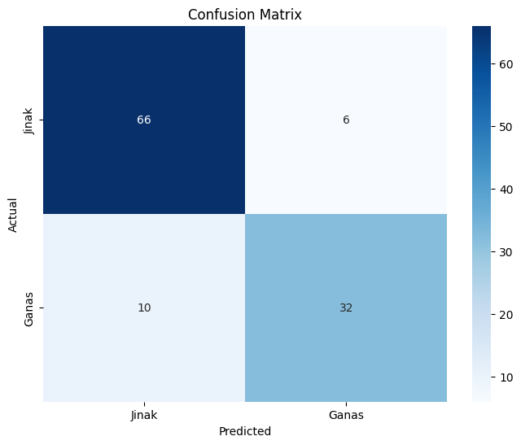
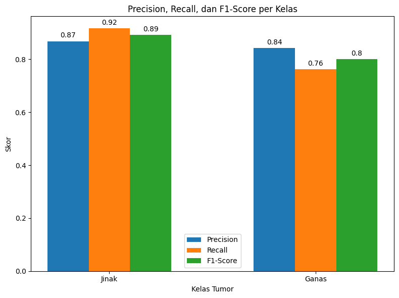

# Deteksi Kanker Payudara dengan Machine Learning
Project ini bertujuan untuk membangun model pengklasifikasian kanker payudara dengan menggunakan dataset 'Breast Cancer Winsconsin (Diagnostic)' dan digunakan untuk pembelajaran akademik.

Tool : Google Colab | [Link Notebook](https://colab.research.google.com/drive/1PrH2szCigRXvBGcxhayFY_0sABToV9Ed?usp=sharing)  
Programming Language : Python  
Libraries : Pandas, NumPy, Scikit Learn, Joblib  
Visualization : Matplotlib, Seaborn  
Source Dataset : UCI Machine Learning Repository | [Link Dataset](https://archive.ics.uci.edu/ml/datasets/Breast+Cancer+Wisconsin+%28Diagnostic%29)  

## 📁 Step by Step
Data ini mempunyai total 569 baris dan 32 kolom dengan total 30 fitur, dengan 1 fitur target. Namun pada projek ini, pengklasifikasian kanker payudara hanya menggunakan 3 parameter, yaitu sebagai berikut:  
|     Fitur     |                                    Deskripsi                                       |
|---------------|------------------------------------------------------------------------------------|
| diagnosis     | Label target, dengan klasifikasi tumor (B = Benign / Jinak, M = Malignant / Ganas) |
|radius_mean    | Rata-rata jarak dari pusat ke batas sel kanker                                     |
|perimeter_mean | Rata-rata panjang keliling sel                                                     |
|area_mean      | Rata-rata area sel                                                                 |

## Preprocessing Data  
1. **Memuat dataset.**
   Langkah pertama yang dilakukan adalah memuat dataset.
   ```phyton
   df = pd.read_csv('data.csv')  
2. **Menghapus kolom yang tidak diperlukan.**  
   Karena fitur yang digunakan dalam project ini hanya 3, sedangkan total fitur yang ada pada dataset ada lebih dari 30, fitur-fitur yang tidak relevan harus dihapus terlebih dahulu.
   ```phyton
   df = df[['diagnosis', 'radius_mean', 'perimeter_mean', 'area_mean']]
3. **Mengubah label kategori.**  
   Pada kolom diagnosis di dataset berisi label B (benign) untuk kanker jinak dan M (malignant) untuk kaknker ganas. Untuk keperluan machine learning, label perlu diubah menjadi angka agar dapat diproses.
   ```phyton
   le = LabelEncoder()
   df['diagnosis'] = le.fit_transform(df['diagnosis'])
4. **Menghapus Missing Values.**  
   Pada dataset, akan ada beberapa baris yang memuliki nilai yang hilang. Pada proses ini, missing value ada dihapus untuk memastikan tidak ada nilai yang kosong pada data yang dapat mengganggu.
   ```phyton
   df.dropna(inplace=True)
5. **Membagi dataset menjadi fitur (X) dan target (Y).**
   Proses ini dilakukan untuk menentukan fitur mana saja yang akan menjadi parameter (X) dan fitur mana yang akan menjadi fitur target (Y).
   ```phyton
   X = df[['radius_mean', 'perimeter_mean', 'area_mean']]  
   y = df['diagnosis']  
6. **Membagi dataset menjadi data train dan data test.**
   Pada proses ini, data akan dibagi menjadi data yang digunakan untuk melatih machine learning dan data yang digunakan untuk menguji kembali hasil pelatihan machine learning.
   ```phyton
      X_train, X_test, y_train, y_test = train_test_split(X, y, test_size=0.2, random_state=42)

## Membuat Model Klasifikasi
1. **Inisialisasi algortima dan melatih model.**  
   Projek ini menggunakan algortima RandomForest karena algoritma ini bisa bekerja baik walaupun fitur yang digunakan dalam dataset memiliki skala yang berbeda-beda, sama halnya seperti dataset yang dipakai pada projek ini. Dan karena menggunakan banyak pohon keputusan, pada kasus ini digunakan 100, sehingga hasil dari algoritma ini bisa lebih stabil dan akurat. Setelahnya, model sudah dapat dilatih dengan data latih dan memprediksinya dengan data uji yang telah dibagi tadi.  
   ```phyton
   model = RandomForestClassifier(n_estimators=100, random_state=42)  
   model.fit(X_train, y_train)
2. **Evaluasi.**
   Evalusai dari data hasil dapat dilakukan melalui classification report dan confusion matrix yang menunjukkan kinerja dari model yang telah dilatih.
   ```phyton
   # Confusion Matrix  
   conf_matrix = confusion_matrix(y_test, y_pred)
   
   # Plot Confusion Matrix  
   plt.figure(figsize=(8, 6))  
   sns.heatmap(conf_matrix, annot=True, fmt='d', cmap='Blues', xticklabels=["Jinak", "Ganas"], yticklabels=["Jinak", "Ganas"])  
   plt.title('Confusion Matrix')  
   plt.xlabel('Predicted')  
   plt.ylabel('Actual')  
   plt.show()

   # Plot Precision, Recall, F1-Score for both classes
   precision = [class_report["Jinak"]["precision"], class_report["Ganas"]["precision"]]
   recall = [class_report["Jinak"]["recall"], class_report["Ganas"]["recall"]]
   f1_score = [class_report["Jinak"]["f1-score"], class_report["Ganas"]["f1-score"]]

   labels = ["Jinak", "Ganas"]
   x = np.arange(len(labels)) 
   width = 0.2 
   fig, ax = plt.subplots(figsize=(8, 6)
   rects1 = ax.bar(x - width, precision, width, label='Precision')
   rects2 = ax.bar(x, recall, width, label='Recall')
   rects3 = ax.bar(x + width, f1_score, width, label='F1-Score')

   ax.set_xlabel('Kelas Tumor')
   ax.set_ylabel('Skor')
   ax.set_title('Precision, Recall, dan F1-Score per Kelas')
   ax.set_xticks(x)
   ax.set_xticklabels(labels)
   ax.legend()

   def add_labels(rects):
    for rect in rects:
        height = rect.get_height()
        ax.annotate('{}'.format(round(height, 2)),
                    xy=(rect.get_x() + rect.get_width() / 2, height),
                    xytext=(0, 3), 
                    textcoords="offset points",
                    ha='center', va='bottom')
   
   add_labels(rects1)
   add_labels(rects2)
   add_labels(rects3)

   fig.tight_layout()
   plt.show()
   
## 📈 Hasil  


